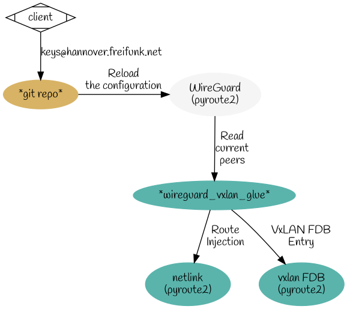

# wireguard-vxlan-glue

This project is based on ffmucs wgkex, but drops everything mqtt-related, as routers in hannover are currently registered via mail.
Other communities may follow; we just wanted to show up a way with WireGuard, yet without the need to deploy mqtt-infrastructure.

Thanks to [munich](https://github.com/freifunkMUC) for their outstanding work and ongoing support!

- [wireguard-vxlan-glue](#wireguard-vxlan-glue)
  * [Overview](#overview)
  * [Installation](#installation)
  * [Configuration](#configuration)
  * [Running the broker](#running-the-broker)
  * [Client usage](#client-usage)
  * [Contact](#contact)
- [WireGuard Key Exchange](#wireguard-key-exchange)

## Overview

wireguard-vxlan-glue reads current peers from WireGuard and applies the corresponding VxLAN FDB and routing entries. Thats all.



This tool is intended to facilitate running BATMAN over VXLAN over WireGuard as a means to create encrypted high-performance mesh links.

## Installation

* Put [this file](netlink.py) on a server, and run it using a service - indefinitely.
* Have another daemon adding wireguard peers from our repo.

## Configuration

* Specify interfaces using `-w` and `-x` and have equal amounts of them.
* Or specify a path to a configfile via `-c` like the provided [netlink_cfg.json.example](netlink_cfg.json.example).

## Bazel

* wireguard-vxlan-glue can also be built and tested via [bazel](https://bazel.build):


```shell
bazel test ...:all
```

## Contact

For problems regarding wireguard-vxlan-glue reach us in our channel

[freifunkh - hackint](ircs://irc.hackint.org:6697/freifunkh)

or take part in ongoing (meta)-development in

[wgkex - IRCNet](ircs://irc.ircnet.net:6697/wgkex)

# WireGuard Key Exchange

The project this is forked from is [WireGuard Key Exchange (wgkex)](https://github.com/freifunkMUC/wgkex), a WireGuard key exchange and management tool designed and run by FFMUC.

